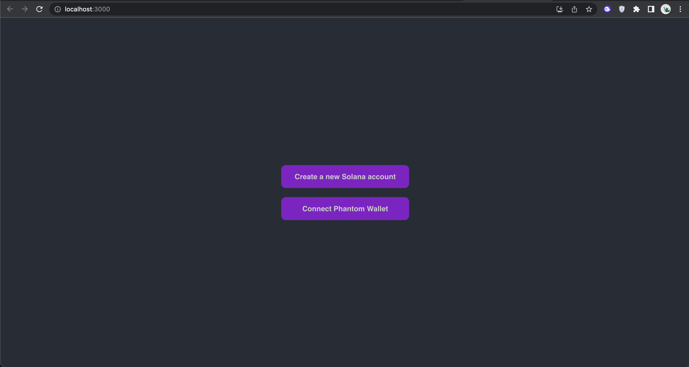
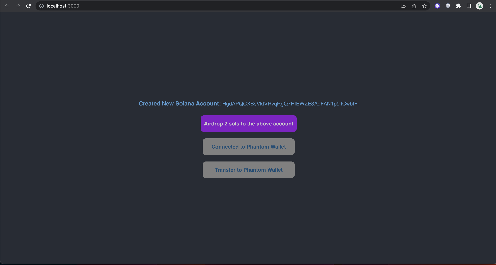

# Solana - Token transfer

Solana Token transfer using Phantom provider

## Description

This program allows the user to do the following:
* Create a new Solana account (Keypair)
* Connect to an existing Phantom wallet (If Phantom wallet extension is not found, it prompts the user to install)
* Airdropping 2 SOLs to the newly created Solana account on the Devnet
* Transfer token from the new account to the existing Phantom account

## Getting Started

### Installing

* Clone this repo 
* Run `npm install` 
* Run `npm start` to start the program on localhost:3000

### Functions present

* Create New Solana Account: To create a new solana account
* Connect Phantom Wallet: To connect to Phantom wallet and get access to an existing account

* Airdrop 2 SOLs to the newly created account: This option appears as soon as the user creates a new account. This allows the user to airdrop 2 SOLs into the newly created account on Devnet.

* Transfer to Phantom Wallet: This option appears once the Phantom wallet connection is established. It is available to use when the newly created account is airdropped with 2 sols. Clicking on this option, would transfer all the SOLs of the newly created account to the Phantom wallet.